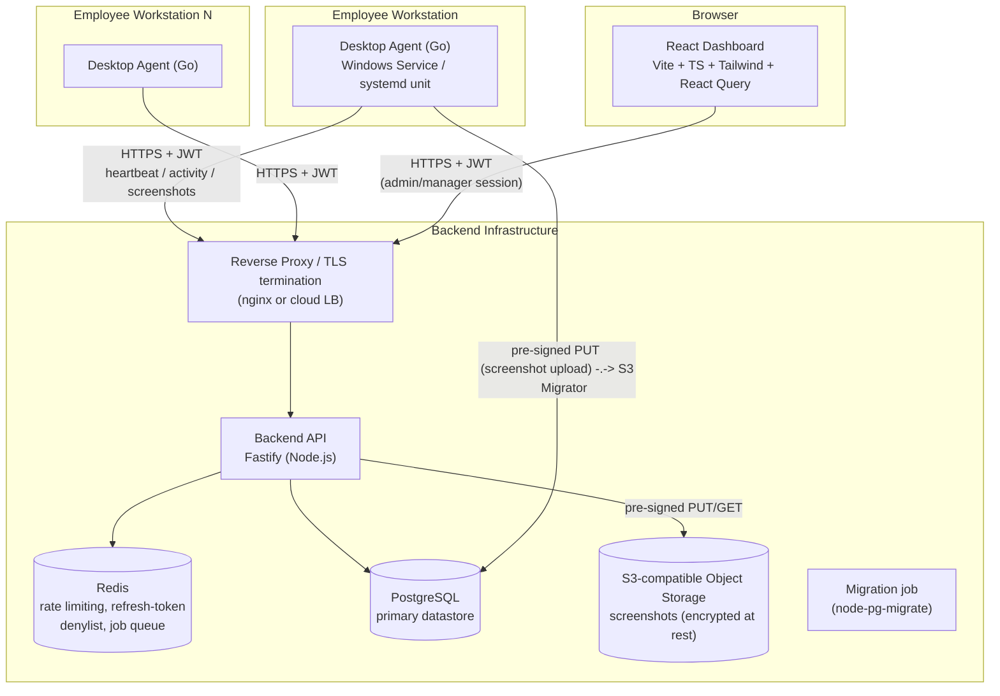
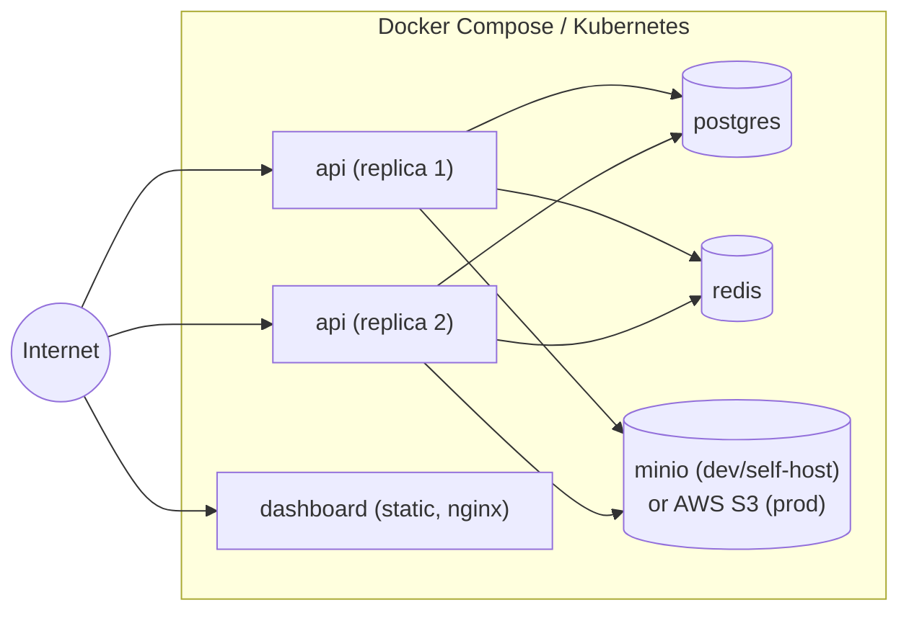

# 1. System Architecture

## 1.1 Component overview

Screenshot uploads use the backend to mint a **pre-signed URL**; the agent
then PUTs the JPEG directly to object storage. This keeps large binary
payloads off the API process and lets the backend stay CPU/memory-light and
horizontally scalable. The API only ever handles small JSON payloads plus
screenshot *metadata*.

## 1.2 Applications

### Desktop Agent (Go)
- One static binary per OS (Windows amd64, Linux amd64/arm64).
- Runs as a **Windows Service** (via `golang.org/x/sys/windows/svc`) or a
  **systemd user/system unit** on Linux — no long-running console window.
- Only UI surface: a minimal native login window (no browser engine, no
  Electron — this is what keeps RAM under budget).
- Talks to the backend exclusively over HTTPS + JWT; never talks to
  Postgres or Redis directly.

### Backend API (Node.js / Fastify)
- Stateless HTTP service; horizontally scalable behind a load balancer.
- Fastify chosen over Express for built-in JSON-schema validation/serialization
  (fast, and gives us request/response validation "for free" which satisfies
  the input-validation requirement), native async/await, and a plugin/DI
  friendly architecture (`fastify.register` = composition root per module).
- PostgreSQL is the single source of truth; Redis is used only for
  ephemeral state (rate-limit counters, refresh-token revocation list,
  optional BullMQ job queue for auto-update artifact processing).

### Dashboard (React)
- Pure SPA (Vite build), served as static assets from a CDN or the same
  reverse proxy; talks only to the Backend API, never to Postgres directly.
- React Query owns all server-state caching/polling; no separate Redux store
  for server data (a small Zustand/Context store is used only for local UI
  state — theme, sidebar, filters).

## 1.3 Deployment topology

- **Local/dev**: `docker-compose.yml` at repo root brings up `postgres`,
  `redis`, `minio`, `backend` (hot-reload), `dashboard` (Vite dev server).
- **Production**: backend ships as a Docker image, deployed with N replicas
  behind a load balancer (session-less — JWT auth means any replica can
  serve any request). Postgres and Redis are managed services in production
  (RDS/Cloud SQL + ElastiCache/Memorystore) rather than containers.

## 1.4 Why these technology choices

| Concern | Choice | Rationale |
|---|---|---|
| Agent language | Go | Single static binary, no runtime to install, excellent cross-compilation (Windows/Linux from one toolchain), low idle memory footprint, mature `syscall`/`windows` packages for OS-level hooks |
| Agent UI | Native minimal window (e.g. `webview` bare login form) | Avoids Electron/Chromium (150–300MB RAM) which would blow the <40MB budget outright |
| Backend framework | Fastify | Schema-based validation/serialization is faster than Express+Joi/Zod middleware chains and doubles as the input-validation layer |
| Backend DB driver | `pg` / `postgres.js` behind a repository interface | Keeps SQL out of services; swappable in tests |
| Screenshot storage | S3-compatible object storage | Binary blobs don't belong in a relational DB; pre-signed URLs offload bandwidth from the API tier |
| Dashboard data layer | React Query | Built-in polling, caching, retry/backoff — exactly what "live employees" and offline-tolerant UI need, without hand-rolled state machines |
| Auth | JWT access token (short-lived) + refresh token (rotating, stored hashed) | Stateless verification for high-frequency agent calls (heartbeat every 30s) without hitting Postgres on every request |

## 1.5 Cross-cutting concerns

- **Observability**: structured JSON logs (agent: local rotating file;
  backend: stdout, shipped by the platform's log driver), `/health` and
  `/ready` endpoints on the API, request-id propagation from dashboard →
  API → logs.
- **Configuration**: 12-factor — all secrets/URLs via environment variables
  in the backend; the agent additionally supports **remote configuration**
  pulled from the API post-authentication (see §1.6).
- **Versioning**: API is versioned via URL prefix `/api/v1/...` from day one.

## 1.6 Remote configuration flow (high level)

The agent does not hardcode heartbeat/screenshot intervals. After login it
calls `GET /api/v1/config/device/:deviceId`, caches the response locally
(so it still works offline), and re-fetches it on every heartbeat response
(the heartbeat response piggy-backs the current config so no extra round
trip is needed on the common path). See
[05-desktop-agent-architecture.md](05-desktop-agent-architecture.md) and
[04-api-specification.md](04-api-specification.md) for details.
