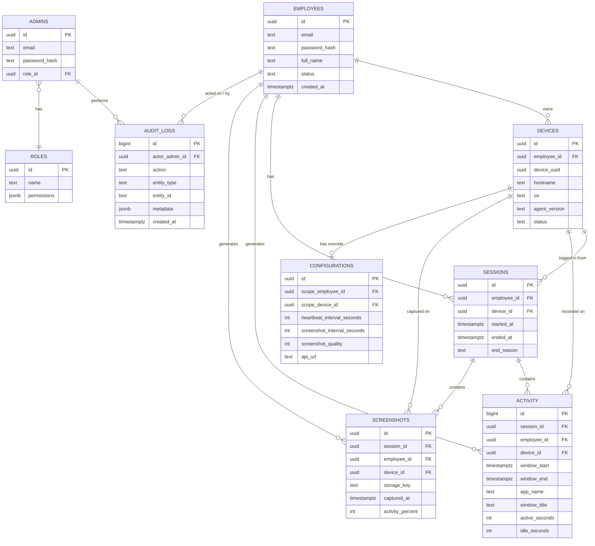

# 3. Database Schema (PostgreSQL)

## 3.1 Entity-relationship overview



## 3.2 Design notes

- **UUID primary keys** (`gen_random_uuid()`, via `pgcrypto`) for every
  entity an external client (agent/dashboard) references, so IDs are never
  guessable/sequential (avoids enumeration attacks on employee/device IDs).
- **`activity` and `audit_logs` use `bigint`/`bigserial`** identity columns
  instead of UUID — these are high-volume, append-only, internal-only rows
  (never referenced by URL), so a cheaper sequential key is appropriate and
  keeps the (very large) index smaller.
- **Screenshots store only metadata** (`storage_key` pointing into S3/MinIO)
  — never the binary — per the storage decision in
  [01-system-architecture.md](01-system-architecture.md).
- **`configurations` supports two override scopes**: an org-wide default row
  (both scope columns `NULL`), an optional per-employee override, and an
  optional per-device override. Effective config = device override →
  employee override → global default (first non-null wins). This satisfies
  "remote configuration" without needing a config row per device by default.
- **Two authentication principals, two tables** (`employees` vs `admins`):
  their trust levels, login surfaces, and lifecycle are different enough
  (employees authenticate from the agent only; admins/managers authenticate
  from the dashboard and can be assigned roles) that merging them into one
  polymorphic table would leak dashboard-only concerns into agent auth.
  A `role_id` on `admins` implements the "role management" requirement;
  employees do not need RBAC roles since the agent only ever acts as
  "self" (no privilege choices to make).
- **`refresh_tokens`** (see below) is not in the original 8-table list but
  is required to implement "JWT refresh tokens" securely (store only a hash
  of the token + rotation metadata, never the raw token) — called out
  explicitly since it's an addition to the requested table set.
- **Soft-delete over hard-delete** for `employees`, `devices`, and `admins`
  (`status`/`deactivated_at`) — monitoring data referencing a departed
  employee must be retained for reporting/compliance history; hard-deleting
  the parent would either cascade-delete history or orphan it.

## 3.3 DDL

```sql
-- Extensions
CREATE EXTENSION IF NOT EXISTS pgcrypto;   -- gen_random_uuid()
CREATE EXTENSION IF NOT EXISTS citext;     -- case-insensitive email

-- =========================================================
-- Roles (admin RBAC)
-- =========================================================
CREATE TABLE roles (
    id          UUID PRIMARY KEY DEFAULT gen_random_uuid(),
    name        TEXT UNIQUE NOT NULL,           -- 'owner' | 'admin' | 'manager' | 'viewer'
    permissions JSONB NOT NULL DEFAULT '{}',    -- fine-grained permission flags
    created_at  TIMESTAMPTZ NOT NULL DEFAULT now()
);

-- =========================================================
-- Admins (dashboard users: owners, admins, managers, viewers)
-- =========================================================
CREATE TABLE admins (
    id             UUID PRIMARY KEY DEFAULT gen_random_uuid(),
    email          CITEXT UNIQUE NOT NULL,
    password_hash  TEXT NOT NULL,               -- argon2id
    full_name      TEXT NOT NULL,
    role_id        UUID NOT NULL REFERENCES roles(id),
    status         TEXT NOT NULL DEFAULT 'active'
                       CHECK (status IN ('active', 'disabled')),
    last_login_at  TIMESTAMPTZ,
    created_at     TIMESTAMPTZ NOT NULL DEFAULT now(),
    updated_at     TIMESTAMPTZ NOT NULL DEFAULT now()
);

-- =========================================================
-- Employees (agent users being monitored)
-- =========================================================
CREATE TABLE employees (
    id             UUID PRIMARY KEY DEFAULT gen_random_uuid(),
    email          CITEXT UNIQUE NOT NULL,
    password_hash  TEXT NOT NULL,
    full_name      TEXT NOT NULL,
    team           TEXT,
    status         TEXT NOT NULL DEFAULT 'active'
                       CHECK (status IN ('active', 'suspended', 'deactivated')),
    monitoring_consent_at TIMESTAMPTZ,           -- disclosure/consent acknowledgement
    created_at     TIMESTAMPTZ NOT NULL DEFAULT now(),
    updated_at     TIMESTAMPTZ NOT NULL DEFAULT now()
);

-- =========================================================
-- Devices (one row per installed agent instance)
-- =========================================================
CREATE TABLE devices (
    id             UUID PRIMARY KEY DEFAULT gen_random_uuid(),
    employee_id    UUID NOT NULL REFERENCES employees(id) ON DELETE CASCADE,
    device_uuid    UUID NOT NULL UNIQUE,         -- stable hardware-derived UUID from agent
    hostname       TEXT NOT NULL,
    os             TEXT NOT NULL CHECK (os IN ('windows', 'linux')),
    os_version     TEXT,
    agent_version  TEXT NOT NULL,
    status         TEXT NOT NULL DEFAULT 'active'
                       CHECK (status IN ('active', 'revoked')),
    last_seen_at   TIMESTAMPTZ,
    registered_at  TIMESTAMPTZ NOT NULL DEFAULT now()
);
CREATE INDEX idx_devices_employee_id ON devices(employee_id);

-- =========================================================
-- Refresh tokens (supports JWT refresh-token rotation)
-- =========================================================
CREATE TABLE refresh_tokens (
    id             UUID PRIMARY KEY DEFAULT gen_random_uuid(),
    principal_type TEXT NOT NULL CHECK (principal_type IN ('employee', 'admin')),
    principal_id   UUID NOT NULL,
    device_id      UUID REFERENCES devices(id) ON DELETE CASCADE,
    token_hash     TEXT NOT NULL UNIQUE,         -- SHA-256 of the raw refresh token
    issued_at      TIMESTAMPTZ NOT NULL DEFAULT now(),
    expires_at     TIMESTAMPTZ NOT NULL,
    revoked_at     TIMESTAMPTZ,
    replaced_by    UUID REFERENCES refresh_tokens(id)
);
CREATE INDEX idx_refresh_tokens_principal ON refresh_tokens(principal_type, principal_id);

-- =========================================================
-- Sessions (one work session = agent login until logout/idle-timeout)
-- =========================================================
CREATE TABLE sessions (
    id           UUID PRIMARY KEY DEFAULT gen_random_uuid(),
    employee_id  UUID NOT NULL REFERENCES employees(id) ON DELETE CASCADE,
    device_id    UUID NOT NULL REFERENCES devices(id) ON DELETE CASCADE,
    started_at   TIMESTAMPTZ NOT NULL DEFAULT now(),
    ended_at     TIMESTAMPTZ,
    end_reason   TEXT CHECK (end_reason IN ('logout', 'idle_timeout', 'device_offline', 'app_closed')),
    last_heartbeat_at TIMESTAMPTZ NOT NULL DEFAULT now()
);
CREATE INDEX idx_sessions_employee_started ON sessions(employee_id, started_at DESC);
CREATE INDEX idx_sessions_open ON sessions(device_id) WHERE ended_at IS NULL;

-- =========================================================
-- Activity (aggregated per-window activity samples; append-only)
-- =========================================================
CREATE TABLE activity (
    id             BIGSERIAL PRIMARY KEY,
    session_id     UUID NOT NULL REFERENCES sessions(id) ON DELETE CASCADE,
    employee_id    UUID NOT NULL REFERENCES employees(id) ON DELETE CASCADE,
    device_id      UUID NOT NULL REFERENCES devices(id) ON DELETE CASCADE,
    window_start   TIMESTAMPTZ NOT NULL,
    window_end     TIMESTAMPTZ NOT NULL,
    app_name       TEXT NOT NULL,
    window_title   TEXT,
    active_seconds INT NOT NULL DEFAULT 0,
    idle_seconds   INT NOT NULL DEFAULT 0,
    created_at     TIMESTAMPTZ NOT NULL DEFAULT now(),
    CHECK (window_end >= window_start)
);
CREATE INDEX idx_activity_employee_window ON activity(employee_id, window_start DESC);
CREATE INDEX idx_activity_session ON activity(session_id);
-- Partition candidate: PARTITION BY RANGE (window_start), monthly, once volume warrants it (see §3.4).

-- =========================================================
-- Screenshots (metadata only; binary lives in object storage)
-- =========================================================
CREATE TABLE screenshots (
    id               UUID PRIMARY KEY DEFAULT gen_random_uuid(),
    session_id       UUID NOT NULL REFERENCES sessions(id) ON DELETE CASCADE,
    employee_id      UUID NOT NULL REFERENCES employees(id) ON DELETE CASCADE,
    device_id        UUID NOT NULL REFERENCES devices(id) ON DELETE CASCADE,
    storage_key      TEXT NOT NULL,              -- object key in S3/MinIO bucket
    thumbnail_key    TEXT,                       -- optional smaller preview
    captured_at      TIMESTAMPTZ NOT NULL,
    uploaded_at      TIMESTAMPTZ NOT NULL DEFAULT now(),
    activity_percent SMALLINT CHECK (activity_percent BETWEEN 0 AND 100),
    app_name         TEXT,
    window_title     TEXT,
    file_size_bytes  INT,
    is_blurred       BOOLEAN NOT NULL DEFAULT false  -- manager-triggered privacy blur
);
CREATE INDEX idx_screenshots_employee_captured ON screenshots(employee_id, captured_at DESC);
CREATE INDEX idx_screenshots_session ON screenshots(session_id);

-- =========================================================
-- Configurations (global default + optional employee/device overrides)
-- =========================================================
CREATE TABLE configurations (
    id                           UUID PRIMARY KEY DEFAULT gen_random_uuid(),
    scope_employee_id            UUID REFERENCES employees(id) ON DELETE CASCADE,
    scope_device_id              UUID REFERENCES devices(id) ON DELETE CASCADE,
    heartbeat_interval_seconds   INT NOT NULL DEFAULT 30,
    screenshot_interval_seconds  INT NOT NULL DEFAULT 600,
    screenshot_quality           SMALLINT NOT NULL DEFAULT 70 CHECK (screenshot_quality BETWEEN 10 AND 100),
    idle_threshold_seconds       INT NOT NULL DEFAULT 300,
    api_url                      TEXT NOT NULL DEFAULT 'https://api.tracker.example.com',
    updated_at                   TIMESTAMPTZ NOT NULL DEFAULT now(),
    updated_by_admin_id          UUID REFERENCES admins(id),
    -- exactly one scope: both null (global default), or exactly one of the two set
    CHECK (
        (scope_employee_id IS NULL AND scope_device_id IS NULL) OR
        (scope_employee_id IS NOT NULL AND scope_device_id IS NULL) OR
        (scope_employee_id IS NULL AND scope_device_id IS NOT NULL)
    )
);
CREATE UNIQUE INDEX uq_config_global ON configurations ((true)) WHERE scope_employee_id IS NULL AND scope_device_id IS NULL;
CREATE UNIQUE INDEX uq_config_employee ON configurations (scope_employee_id) WHERE scope_employee_id IS NOT NULL;
CREATE UNIQUE INDEX uq_config_device ON configurations (scope_device_id) WHERE scope_device_id IS NOT NULL;

-- =========================================================
-- App versions (auto-update)
-- =========================================================
CREATE TABLE app_versions (
    id             UUID PRIMARY KEY DEFAULT gen_random_uuid(),
    platform       TEXT NOT NULL CHECK (platform IN ('windows', 'linux')),
    version        TEXT NOT NULL,               -- semver, e.g. '1.4.2'
    download_url   TEXT NOT NULL,
    checksum_sha256 TEXT NOT NULL,
    release_notes  TEXT,
    is_mandatory   BOOLEAN NOT NULL DEFAULT false,
    published_at   TIMESTAMPTZ NOT NULL DEFAULT now(),
    UNIQUE (platform, version)
);
CREATE INDEX idx_app_versions_latest ON app_versions(platform, published_at DESC);

-- =========================================================
-- Audit logs (admin actions + sensitive read access)
-- =========================================================
CREATE TABLE audit_logs (
    id              BIGSERIAL PRIMARY KEY,
    actor_admin_id  UUID REFERENCES admins(id),
    action          TEXT NOT NULL,               -- e.g. 'employee.screenshot.view', 'admin.role.update'
    entity_type     TEXT NOT NULL,               -- 'employee' | 'device' | 'screenshot' | 'admin' | 'configuration'
    entity_id       TEXT,
    metadata        JSONB NOT NULL DEFAULT '{}',
    ip_address      INET,
    created_at      TIMESTAMPTZ NOT NULL DEFAULT now()
);
CREATE INDEX idx_audit_logs_actor ON audit_logs(actor_admin_id, created_at DESC);
CREATE INDEX idx_audit_logs_entity ON audit_logs(entity_type, entity_id);
```

## 3.4 Retention, partitioning & indexing strategy

- `activity` is the highest-volume table (one row per app/window switch,
  potentially thousands of rows/employee/day). Recommend **monthly range
  partitioning by `window_start`** once a tenant exceeds ~10M rows, with a
  scheduled job to detach/archive partitions older than the retention
  policy (commonly 90–180 days of raw activity; older data pre-aggregated
  into daily rollups for reporting).
- `screenshots` binaries in object storage get an **S3 lifecycle rule**
  (e.g., move to cold/infrequent-access storage after 30 days, delete after
  the org's retention period) — independent of the Postgres row, which is
  cheap to keep longer for reporting metadata.
- `audit_logs` should never be deleted by application code; only a
  time-boxed archival job (compliance requirement) moves old rows to cold
  storage.
- All foreign keys from high-volume tables (`activity`, `screenshots`) back
  to `employees`/`devices`/`sessions` are indexed to keep the dashboard's
  "employee timeline" and "reports" queries index-only scans.

## 3.5 Migrations

Managed with `node-pg-migrate` (backend/migrations/*.js), one file per
schema change, run via a dedicated migration step in the Docker
image/CI pipeline — never `synchronize`/auto-migrate in application startup
code.
