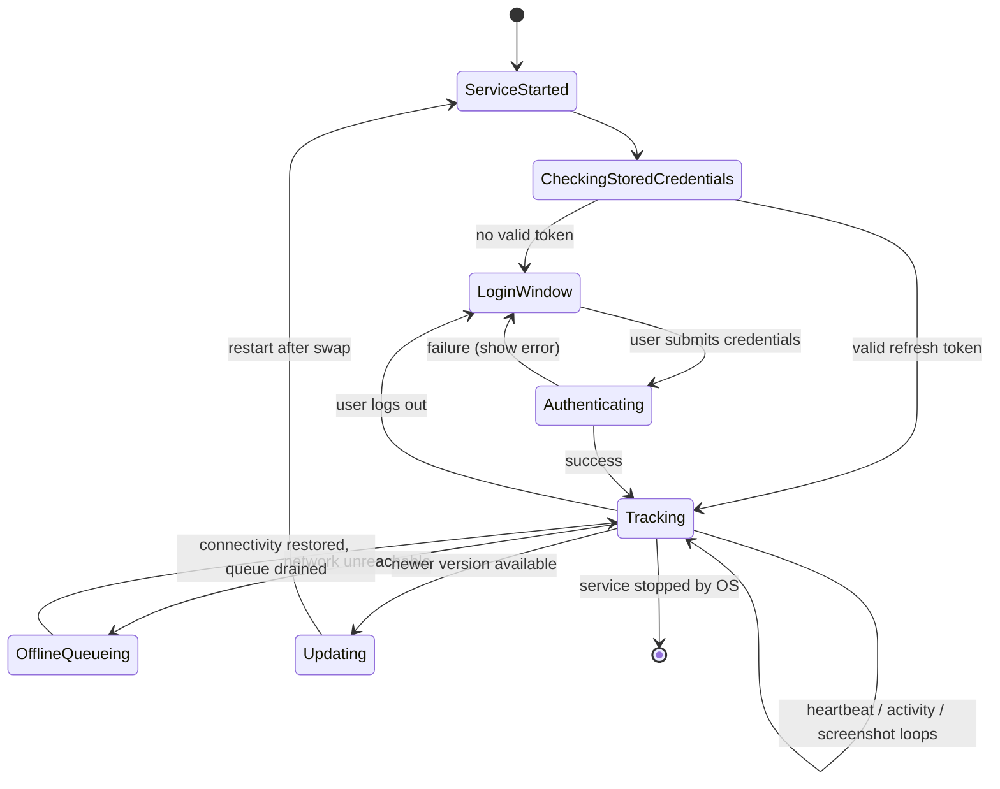
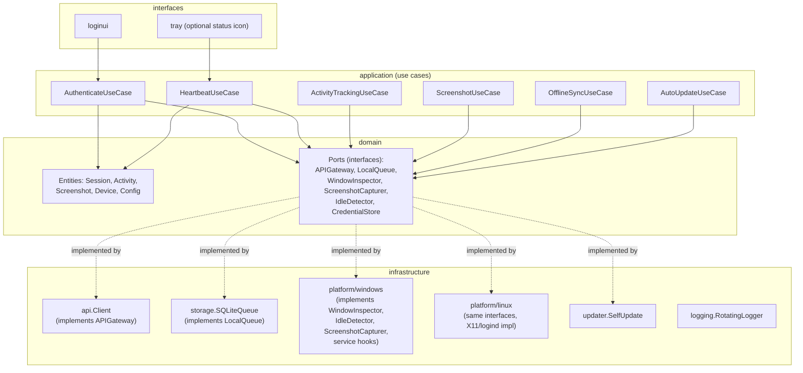

# 5. Desktop Agent Architecture (Go)

## 5.1 Goals that shape every decision here

| Constraint | Design consequence |
|---|---|
| < 2% CPU | No polling loops tighter than 1s; idle detection uses OS event hooks where available, not busy-polling; JPEG encode happens once per screenshot interval (default 10 min), not continuously |
| < 40MB RAM | No embedded browser/Electron; native OS APIs via `syscall`/`cgo`-free bindings where possible; small dependency graph; images streamed to disk instead of buffered fully in memory during multi-part upload |
| Windows 10/11 + Ubuntu | All OS-touching code isolated behind interfaces in `internal/domain/ports.go`, implemented per-OS using Go build tags (`_windows.go` / `_linux.go`), compiled from one shared codebase |
| Background service, auto-start on login | Windows Service (`golang.org/x/sys/windows/svc`) registered via the installer; Linux systemd unit (`WantedBy=default.target`, user service) enabled by the `.deb` postinst script |
| No GUI except login | The only window shown is a native login form; after successful auth the process detaches into background/tray-only mode |

## 5.2 Process lifecycle



- Credentials are never stored in plaintext: the refresh token is stored via
  **Windows DPAPI** (`CryptProtectData`) on Windows and the **kernel
  keyring / `libsecret`** on Linux (fallback: file with `0600` perms
  encrypted with a machine-derived key, only if no keyring service is
  present — e.g., headless Ubuntu server use case).
- The service keeps running across login-window→tracking transitions; the
  window is just a UI surface toggled on/off, not a separate process, so
  the OS-level "service" registration never has to restart.

## 5.3 Internal architecture (Clean Architecture, mirrors §2 folder layout)



`cmd/agent/main.go` is the composition root: it detects the OS at build
time (via Go build tags, not runtime branching) and wires the matching
`platform/windows` or `platform/linux` implementations into the use cases
through constructor injection. Application code (`internal/application/*`)
never imports `platform/*`, `syscall`, or `windows/svc` — it only sees the
`domain.Ports` interfaces, which is what makes the use cases unit-testable
with in-memory fakes on any dev machine regardless of OS.

## 5.4 Scheduler (concurrency model)

A single `Scheduler` goroutine owns three `time.Ticker`s and fans work out
to bounded worker goroutines via channels — this keeps CPU usage
predictable (no goroutine leaks, no unbounded concurrent uploads):

```go
// illustrative shape, not final code — architecture only
type Scheduler struct {
    heartbeatTicker  *time.Ticker // default 30s, remotely configurable
    screenshotTicker *time.Ticker // default 10m, remotely configurable
    idleSampler      *time.Ticker // 5s local sampling, aggregated into activity rows
    uploadQueue      chan UploadJob
}
```

- **Idle sampling** runs every 5s locally (cheap OS call: `GetLastInputInfo`
  on Windows, `XScreenSaverQueryInfo`/`org.freedesktop.login1` idle hint on
  Linux) and is aggregated in-memory into `active_seconds`/`idle_seconds`
  buckets — only flushed to the local queue/API on the heartbeat tick, so
  the network/DB write rate stays at the 30s cadence, not 5s.
- **Screenshot capture** runs on its own ticker so a slow screenshot upload
  never delays the heartbeat.
- **Upload worker pool** is capped (default: 2 concurrent uploads) so a
  backlog after reconnecting doesn't spike CPU/bandwidth.
- Config changes (interval updates from the heartbeat response) call
  `ticker.Reset(...)` rather than tearing down/recreating goroutines.

## 5.5 Offline queue & sync

- Local **SQLite** database (`internal/infrastructure/storage/sqlite_queue.go`)
  is the durable buffer for both activity batches and pending screenshot
  uploads (screenshot files themselves are written to a local temp
  directory; the SQLite row stores the file path + metadata + upload
  state: `pending` → `uploading` → `uploaded` → deleted).
- Chosen over an in-memory queue because the agent must survive process
  restarts (OS update, crash, manual service restart) without losing
  buffered tracking data — durability is the entire point of "offline
  mode" in the requirements.
- `OfflineSyncUseCase` runs on every heartbeat tick: if the last heartbeat
  succeeded, attempt to drain N oldest queued items via
  `POST /activity/batch` and the screenshot upload-url flow; exponential
  backoff (capped) on repeated network failures so a prolonged outage
  doesn't spin the CPU.
- A retention cap (e.g., 7 days or configurable max queue size) prevents
  unbounded disk growth if a device is offline for an extended period;
  oldest-first eviction with a warning logged.

## 5.6 Platform-specific implementation notes

### Windows
- Active window / process name: `GetForegroundWindow` +
  `GetWindowThreadProcessId` + `QueryFullProcessImageName`.
- Idle time: `GetLastInputInfo`.
- Screenshot: `BitBlt` from the desktop DC (or `Windows.Graphics.Capture`
  on Win10 1903+) → encode JPEG via Go's standard `image/jpeg` (no cgo).
- Service: `golang.org/x/sys/windows/svc` + `svc.Run`; installed via the
  NSIS installer, which also creates the service with
  `SERVICE_AUTO_START` and a recovery policy (auto-restart on crash).
- Auto-start on user login is implicit in running as a Windows Service
  (`Local System` or a dedicated service account) — no separate Run-key
  entry is needed, which is more robust than a startup-folder shortcut.

### Linux (Ubuntu, X11 primary; Wayland noted as a gap)
- Active window / process name: X11 via `_NET_ACTIVE_WINDOW` /
  `_NET_WM_PID` (using a lightweight pure-Go X11 client, e.g.
  `jezek/xgb`, to avoid a cgo/Xlib dependency and keep static linking).
- Idle time: `org.freedesktop.ScreenSaver` D-Bus interface or
  `XScreenSaverQueryInfo`.
- Screenshot: `XGetImage` on the root window, encoded the same JPEG path
  as Windows.
- **Wayland caveat** (called out explicitly, not silently ignored): Wayland
  compositors sandbox window enumeration and screen capture by design
  (no `_NET_ACTIVE_WINDOW` equivalent, capture requires portal
  permission dialogs per-session under `xdg-desktop-portal`). Ubuntu
  22.04+ defaults to Wayland (GNOME). **Decision needed**: either (a) the
  agent targets X11 sessions only for v1 and documents this as a
  supported-environment limitation, or (b) budget a dedicated
  `platform/linux/wayland` implementation using
  `xdg-desktop-portal`'s `Screenshot`/`RemoteDesktop` portals (interactive
  permission prompt on first use — conflicts with "no GUI" and "runs as a
  background service" unless handled once at agent install time). This is
  flagged in the roadmap (Phase 3) as a decision point, not resolved here.
- Service: native `systemd` unit
  (`agent/build/linux/tracker-agent.service`), `WantedBy=graphical-session.target`
  as a **user** service (needed for D-Bus/X11 session access — a system-level
  daemon cannot reach the logged-in user's X11 display without extra
  `XAUTHORITY` plumbing), enabled via `systemctl --user enable` from the
  `.deb` postinst, with `systemctl --user daemon-reload`.

## 5.7 Screenshots

- Capture → downscale (configurable max dimension, default 1600px on the
  long edge, to bound both CPU and upload size) → JPEG encode at the
  remotely configured `screenshotQuality` (default 70) →
  write to local temp file → enqueue upload job.
- Upload is always async relative to capture: capture never blocks on
  network I/O, satisfying both the CPU budget and the offline requirement.
- One "capture on login" screenshot is triggered immediately after
  `sessions/start` succeeds, independent of the interval ticker (which
  starts counting from that point).

## 5.8 Auto-update

```
1. On every heartbeat tick (throttled to at most once/hour), UpdateUseCase
   calls GET /version/latest?platform=...
2. If remote semver > running version (or isMandatory=true):
   a. Download the artifact to a temp path.
   b. Verify sha256 checksum against the API-provided value.
   c. Reject if signature/checksum mismatch — log + alert, do not apply.
3. On success:
   - Windows: stage the new binary, ask the Service Control Manager to
     restart the service pointing at the new binary (self-replace pattern:
     write to a versioned path, update a "current" symlink/junction, then
     trigger service restart — avoids "file in use" errors overwriting a
     running .exe).
   - Linux: same versioned-directory + symlink swap, then
     `systemctl --user restart tracker-agent`.
4. Update is applied only when no screenshot/upload is in flight (checked
   via an in-process "quiescent" flag) to avoid corrupting an in-progress
   upload.
```

## 5.9 Logging

- `internal/infrastructure/logging/rotating_logger.go`: structured
  (JSON-lines) daily-rotating file logger (`lumberjack`-style rotation:
  daily or size-capped, whichever first, gzip old files, cap total
  retained history, e.g. 14 days) written to the OS-appropriate location
  (`%ProgramData%\Tracker\logs` on Windows,
  `/var/log/tracker-agent/` or `~/.local/state/tracker-agent/logs` on
  Linux depending on service scope).
- No PII beyond what's operationally necessary in logs (window titles are
  *not* logged locally — they're only ever transmitted over the
  authenticated API channel — to reduce local data exposure if a laptop
  disk is compromised).

## 5.10 Resource budget verification plan

Because <2% CPU / <40MB RAM are hard product requirements, not
aspirational, the roadmap (Phase 3) includes a dedicated soak-test task:
run the compiled agent for 24h on a reference Windows and Ubuntu VM under
typical desktop use, sampling RSS and CPU% every minute, and gate the
release on staying under budget at the 95th percentile (brief spikes
during JPEG encode/upload are expected and acceptable; sustained usage is
not).
