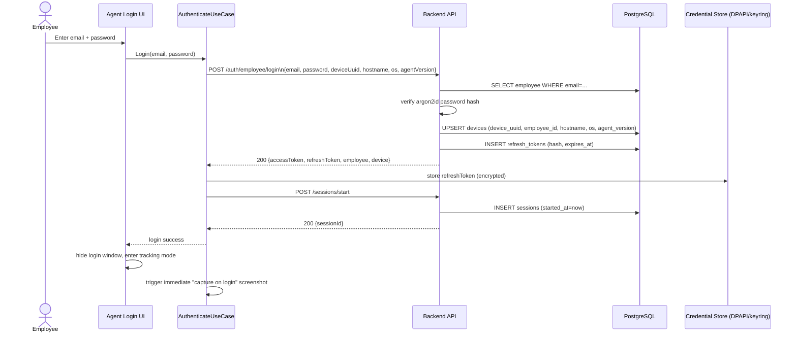
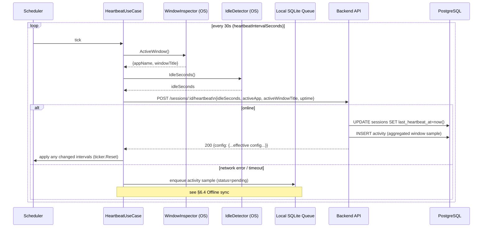
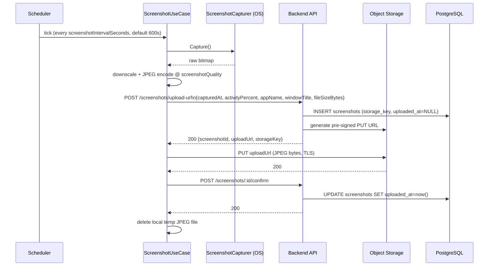
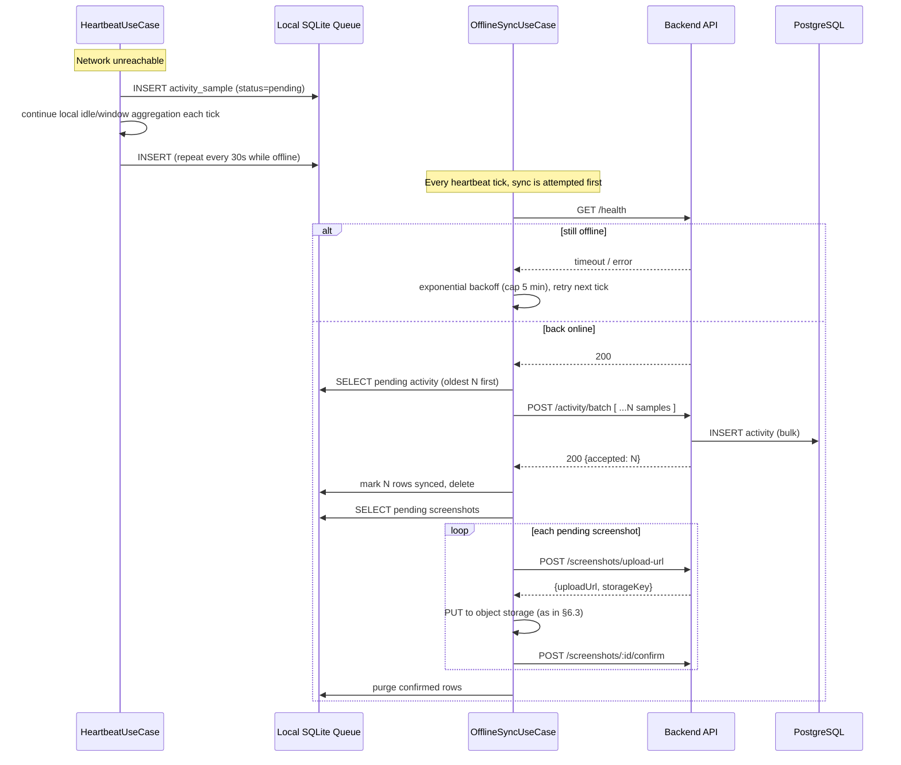
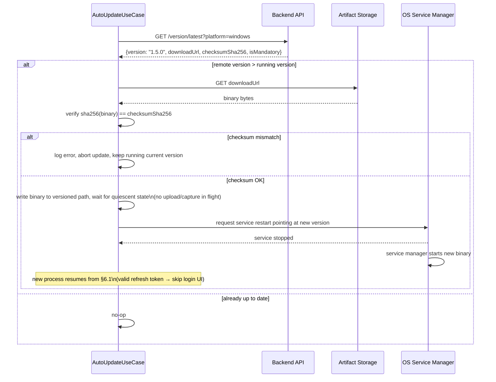

# 6. Sequence Diagrams

## 6.1 Employee login & device registration



## 6.2 Heartbeat + activity tracking (steady state)



## 6.3 Screenshot capture & upload (online path)



## 6.4 Offline queueing & auto-sync on reconnect



## 6.5 Auto-update



## 6.6 Admin views the live dashboard

```mermaid
sequenceDiagram
    actor Mgr as Manager
    participant Dash as React Dashboard
    participant RQ as React Query
    participant API as Backend API
    participant DB as PostgreSQL
    participant Audit as audit-log.middleware

    Mgr->>Dash: open "Live Employees" page
    Dash->>RQ: useQuery('live-employees', { refetchInterval: 15s })
    RQ->>API: GET /dashboard/live
    API->>DB: SELECT sessions JOIN employees JOIN devices\nWHERE ended_at IS NULL
    API->>API: derive online/offline from now() - last_heartbeat_at\nvs 2 * heartbeat_interval
    API-->>RQ: 200 {data: [{employee, device, status, currentApp, currentWindow, idleSeconds}, ...]}
    RQ-->>Dash: render employee cards
    Mgr->>Dash: click employee -> open screenshot
    Dash->>API: GET /screenshots/:id
    API->>Audit: log {action: 'employee.screenshot.view', actorAdminId, entityId}
    API->>DB: INSERT audit_logs
    API-->>Dash: 200 {data: {..., viewUrl: pre-signed GET, expiresIn: 60}}
    Dash->>Dash: render image from short-lived URL
    Note over RQ,API: React Query re-polls every 15s;\nno WebSocket in MVP (see 01-system-architecture.md §Open Questions)
```
